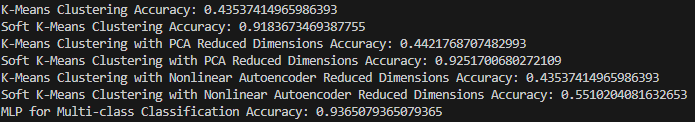

# AI and Machine Leanring Final Project

12111820 黄国靖

## Results

#### Multi-Class Classification

  
  
  
  
  
  
  
  
  
  
  
  
  
  

#### Binary Classification

  
  
  

## Analysis

## Summary

