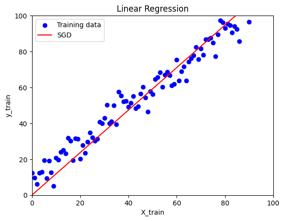
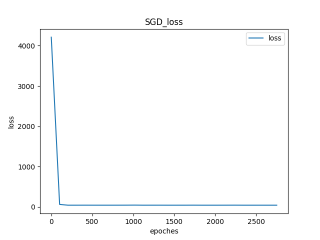
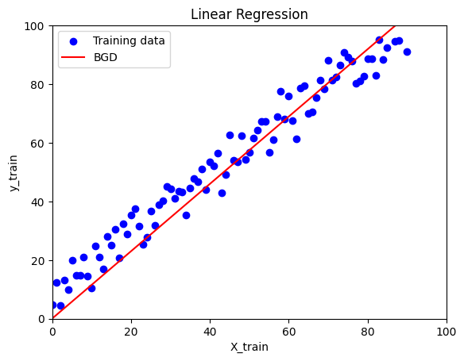
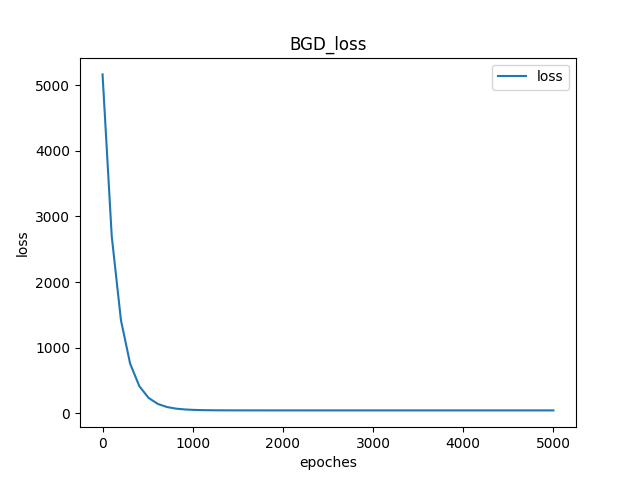
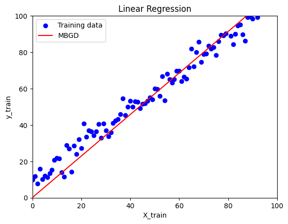
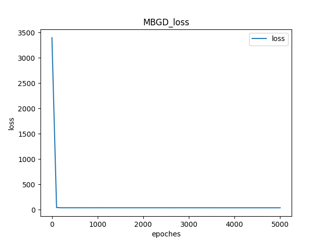
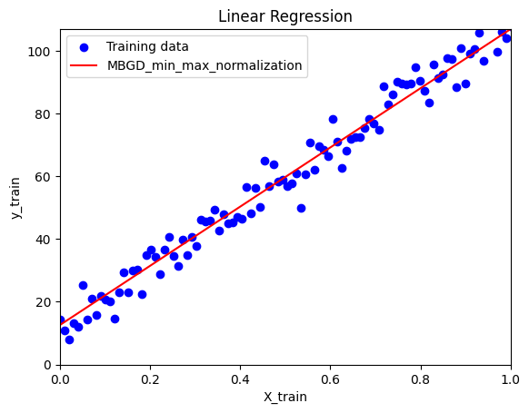
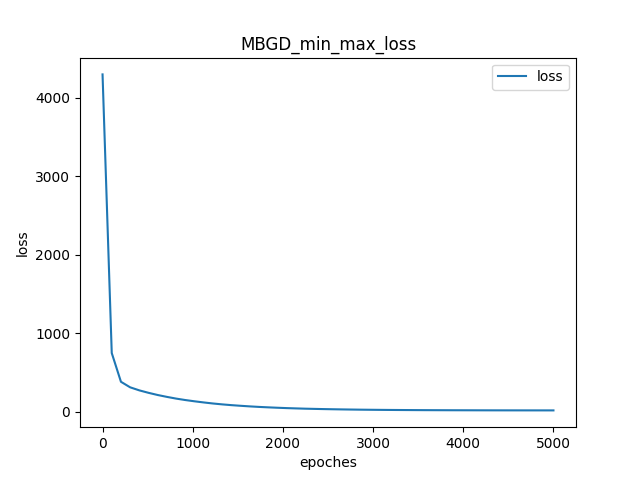
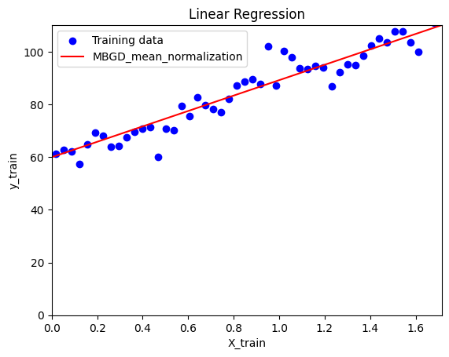
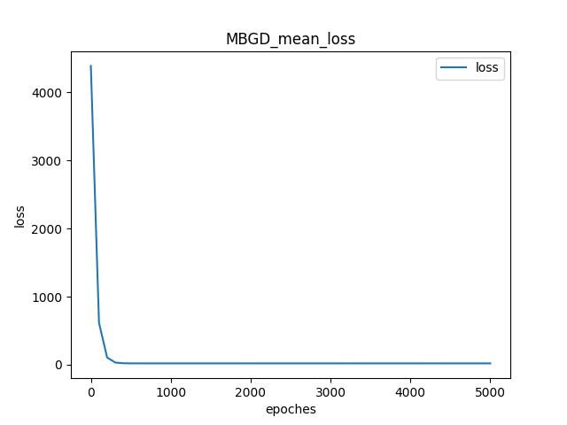

# AI and Machine Leanring HW-02
**12111820 黄国靖**

作业说明: Using Python and Numpy, write a class named LinearRegression, implementing linear regression model 
- Consider MSE loss
- Write three update methods in the class, i.e., SGD, BGD,and MBGD 
- Add min-max normalization and mean normalization to the class

Test your linear regression model
- Consider the data set generated from the codes in next page
- Adopt the linear regregression model
- Try SGD, BGD, and MBGD and analyze what you observe during training
- Try using min-max normalzation, mean normalization, as well as without normalization, and then analyze what you observe during training
- Use matplotlib to plot the data as well the line learned for all above try

## SGD
 

SGD的learning rate为1e-5, iteration为2750, loss大约是42左右,拟合效果较好

## BGD
 

BGD的learning rate为1e-6, iteration为5000, loss大约是44左右,拟合效果略差

## MBGD
 

MBGD的learning rate为1e-4, iteration为5000, batch_size为10,loss大约是36左右,拟合效果好

## MBGD with min_max_normalization
 

此时的learning rate为1e-2, iteration为5000, batch_size为10,loss大约是20左右,拟合效果很好,在训练过程中需要人为增大leraning rate

## MBGD with mean_normalization
 

此时的learning rate为1e-1, iteration为5000, batch_size为10,loss大约是20左右,拟合效果很好,在训练过程中需要人为增大leraning rate