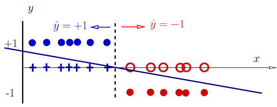
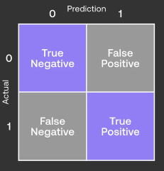

# Classification and Logistic Regression

noted by Acheng0211(Guojing Huang, SUSTech)

- [Classification and Logistic Regression](#classification-and-logistic-regression)
    - [**1.** Classification problem](#1-classification-problem)
    - [**2.** Perceptron](#2-perceptron)
    - [**3.** Metrics](#3-metrics)
    - [**4.** Logistic regression](#4-logistic-regression)
    - [**5.** Summary](#5-summary)
___

### **1.** <big>Classification problem</big>

- Features in common: categorical **outputs**, called **labels** 
- Classification: Assigning each input vector to one of a finite number of labels.(Binary/Multiclass ~ = two/multiple possible labels) 

[back to the top](#classification-and-logistic-regression)

### **2.** <big>Perceptron</big>

- perceptron(linear classifier): $y = sign(z(x,w)) = sign(w_0 + w_1x) = sign(w^T\bar{x})$

- **decision boundary**(hyperplane): $w_0 + w_1x_1 + ... + w_nx_n = 0$. 1D: threshold, 2D: line, 3D: plane
- Loss function: $$ l(w) = \left\{ \begin{matrix} 0 \qquad if \quad y(x^{(n),w})=t^{(n)}\\ positive \quad if \quad y(x^{(n),w})\neq t^{(n)} \end{matrix} \right. = [-t^{(n)}z(x^{(n)},w)]_{+}$$
    $$\nabla l(w) = \left\{ \begin{matrix} 0 \qquad if \quad y(x^{(n),w})=t^{(n)}\\ -t^{(n)} \bar{x}^{(n)} \quad if \quad y(x^{(n),w})\neq t^{(n)} \end{matrix} \right.$$
- Perceptron can only deal with linearly separable problem
- Causes of non perfect separation:
  - Model is too simple (perceptron)
  - Noises in the inputs (i.e., data attributes)
  - Simple features that do not account for all variations
  - Errors in data targets (mis-labellings)

[back to the top](#classification-and-logistic-regression)

### **3.** <big>Metrics</big>

- **Accuracy**: gives the percentage of correct classifications $$A = \frac{TP+TN}{TP+FP+FN+TN}$$
- **Recall**: is the fraction of relevant instances that are retrieved $$R = \frac{TP}{TP+FN} = \frac{TP}{all groundtruth instances}$$
- **Precision**: is the fraction of retrieved instances that are relevant $$P = \frac{TP}{TP+FP} = \frac{TP}{all predicted true}$$
- **F1 score**: harmonic mean of precision and recall $$F1 = 2\frac{P·R}{P+R}$$

[back to the top](#classification-and-logistic-regression)

### **4.** <big>Logistic regression</big>

[back to the top](#classification-and-logistic-regression)

### **5.** <big>Summary</big>

[back to the top](#classification-and-logistic-regression)