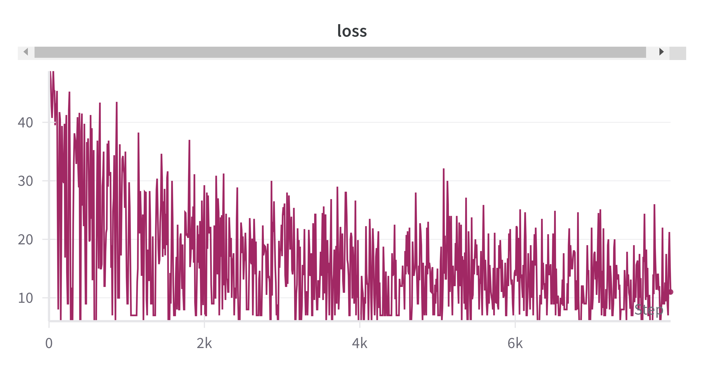
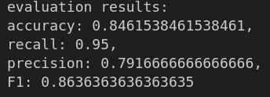
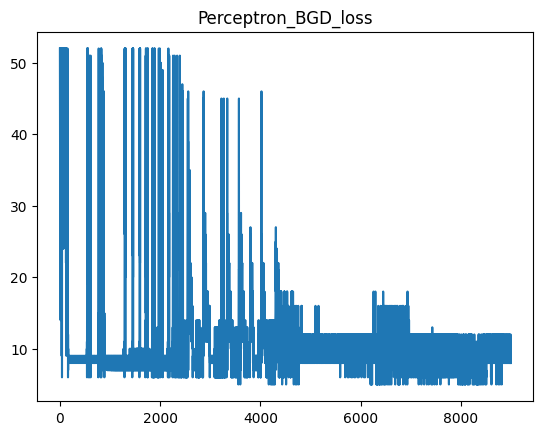

# AI and Machine Leanring HW-03
**12111820 黄国靖**

### 作业说明
The wine.data dataset contains a total of 178 data points, each representing a wine sample with a class label and 13 features, which are chemical indicators such as alcohol content and malic acid concentration. More detailed information can be found the file titled wine.names.

Remove one class of wine samples from the dataset, retaining the other two classes to generate a new dataset. Use a Perceptron to address the binary classification problem of wine.

1. Write code to split the dataset into a training set and a test set in the ratio of (0.7, 0.3).
2. Write separate Perceptron codes for Batch update and Stochastic update to train the model.
3. Use the trained model to make predictions on the test set, and write code to evaluate the model's classification performance using Accuracy, recall, precision, and F1 score.w

## SGD
 

使用SGD进行训练时并没有出现early stop

## BGD
 

使用BGD进行训练时也没有出现early stop