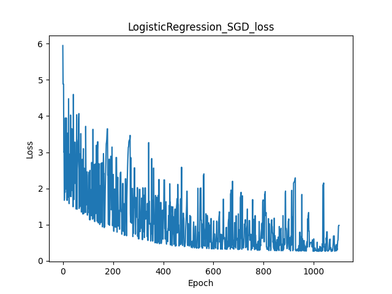

# AI and Machine Leanring HW-04
**12111820 黄国靖**

## Introduction
Use the data set of previous homework assignment, namely wine.data.
Remove one class of wine samples from the dataset, retaining the other two classes to generate a new dataset. Consider the logistic regression model and cross-entropy loss function to address the binary classification problem of wine.
1.Write code to split the dataset into a training set and a test set in the ratio of (0.7, 0.3).
2.Write codes for Mini-batch update and Stochastic update to train the model.
3.Use the trained model to make predictions on the test set, and write code to evaluate the model's classification performance using Accuracy, recall, precision, and F1 score.
4. Analyze and conclude the difference between perceptron and logistic regression model. 

## Methodology
1. Preprocess input data by adding a line of 1
2. Get predicted output by input dot-multiply weights
3. Compute loss of each epoch based on loss function
4. Complete gradient decent using two different strategies and update weights
5. Plot the figure of loss

The training settings are shown as following.
 

## Results

### SGD
There is an early stop occured at *epoch = 1100*, when using Stochastic update, with slow convergence and worse performance.
 

### MBGD
There is an early stop occured at *epoch = 3403* when using Mini-batch update, either, but with faster convergence and better performance.
 

## Conclusion
1. Mini-Batch update is better than Stochastic update considering the convergence of loss.
2. Perceptron has better classification performance(higher score), but logistic regression can make classifcation converge faster.