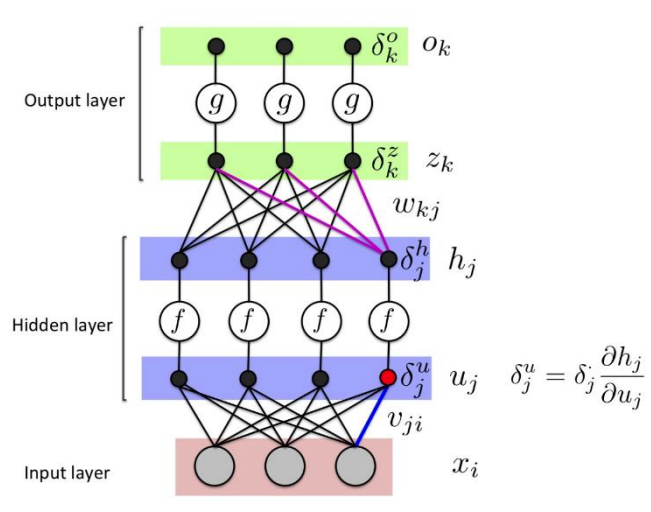

# Multi-layer Perceptron 

noted by Acheng0211(Guojing Huang, SUSTech)

- [Multy-layer Perceptron](#1-multy-layer-perceptron)
- [Forward Propagation](#2-forward-propagation)
- [Backward Propagation](#3-backward-propagation)
- [Summary](#summary)
___

### **1.** <big>Multy-layer Perceptron</big>

- Mathematical model of a neuron: 
- Activation functions:
    - **Sigmoid**: $\sigma(x) = \frac{1}{1+e^{-z}}$
    - **Tanh**: $tanh(z) = \frac{e^{z} - e^{-z}}{e^{z} + e^{-z}}$
    - **ReLU(Rectified Linear Unit)**: $ReLU(z) = max(0,z)$
 
- Neural network architecture
    - Naming convention: $N_{layer} = (N-1)$(layers of hidden units) $+ 1$(output layer), input layer is not counted
- Reprensentational power
    - Neural network with **at least one hidden layer** is a universal approximator which can represent any function
    - The capacity of the network increases with more hidden units and layers
- two basic algorithms
    - **Forward pass**: performs inference
    - **Backward pass**: performs learning

[back to the top](#multi-layer-perceptron)

### **2.** <big>Forward Propagation</big>

- compute the output given the input
- output: $h_j(x) = f(v_{j0} + \displaystyle \sum^D_{i=1}x_iv_{ji})$, $o_k(x) = g(w_{k0} + \displaystyle \sum^J_{j=1}h_j(x)w_{kj})$

[back to the top](#multi-layer-perceptron)

### **3.** <big>Backward Propagation</big>

- Train a network can adjust all the parameters $w = [w_0,w_1,...,w_D]$
- Design a loss function: cross-entropy $E(w) = -\displaystyle \sum^N_{n=1}[t^{n}log(o^{(n)}) + (1-t^{n})log(1-o^{(n)})]$
- Gradient decent: $$w(t+1) = w(t) - \eta \Delta E(w)$$
- Derivatives of the loss function: 

|name|function|derivatie|
|---|---|---|
|Sigmoid|$\sigma(z) = \frac{1}{1+e^{-z}}$|$\sigma(z)(1-\sigma(z))$|
|Tanh|$tanh(z) = \frac{e^{z} - e^{-z}}{e^{z} + e^{-z}}$|$1 - cosh^2(z)$, $cosh(z) = \frac{e^z+e^{-z}}{2}$|
|ReLU|$ReLU(z) = max(0,z)$|$1$ if $z>0$, 0 otherwise|

- An effective method for computing gradiens needed to perform gradient-based optimization of the weights in a multi-layer network (key insight: **chain rule**)
- Procedure:
    1. Forward pass: compute the output of the network
    2. Backward pass: compute the gradient of the loss function with respect to the weights
    3. Update the weights using the gradient
    4. Repeat until convergence
- Computing gradients: Single layer network

    1. Error gradients: $\frac{\partial E}{\partial w_{ki}} = \frac{\partial E}{\partial o_{k}}\frac{\partial o_k}{\partial z_{k}}\frac{\partial z_k}{\partial w_{ki}} = \delta^o_k\frac{\partial o_k}{\partial z_{k}}\frac{\partial z_k}{\partial w_{ki}} = \delta^z_k\frac{\partial z_k}{\partial w_{ki}} = \delta^z_k\cdot x_i$, computabkle for any **coninuous** activation function and error function
    2. Forward propagation: 
    $$1： z_k = w_{k0} + \displaystyle \sum^D_{i=1}w_{ki}x_{i}$$ $$2： o_k = g(z_k)$$
    3. Backward propagation: 
    $$1： \delta^o_k = o_k - t_k$$ $$2： \delta^z_k = \delta^o_kg'(z) = \delta^o_k\cdot g(z)(1-g(z)) = \delta^o_k\cdot o_k(1-o_k)$$ $$3： \frac{\partial E}{\partial w_{ki}} = \delta^z_k\cdot x_i$$
- Gradient decent for multi-layer network

    1. weight gradients: 
        - output-layer: $\frac{\partial E}{\partial w_{kj}} = \frac{\partial E}{\partial o^{(n)}_k}\frac{\partial o^{(n)}_k}{\partial z^{(n)}_k}\frac{\partial z^{(n)}_k}{\partial w_{kj}} = \delta^{z,(n)}_kh^{(n)}_j$, $\delta^{z,(n)}_k$ is the error w.r.t. the net input for unit $k$
        - hidden-layer: 
        <!-- todo: complete gd for mlp -->
    

- Ways to use weight derivatives
    - update in the scalar form: $w_{ki} \leftarrow w_{ki} - \eta\nabla \frac{\partial E}{\partial w_{ki}} = w_{ki} - \eta \displaystyle \sum^N_{n=1} \frac{\partial E(o^{(n)},t^{(n)})}{\partial w_{ki}}$
    - update in the matrix form: $W \leftarrow W - \eta\nabla \frac{\partial E}{\partial W} = W - \eta \displaystyle \sum^N_{n=1} \frac{\partial E(o^{(n)},t^{(n)})}{\partial W}$
    - Use a fixed learning rate and add momentum: $w_{ki}\leftarrow w_{ki} - v, v \leftarrow \gamma v + \eta \frac{\partial E}{\partial w_{ki}}$
- Overfitting
    - noise & sampling error
    - to prevent:
        1. model with right capacity: validation set
        2. limit the numeber of hidden units
        3. limit the norm of the weights: weight-decay, improve generalization, smooher $$C = E + \frac{\lambda}{2} \displaystyle \sum_i w^2_i$$ keep weights small unless they have big error derivatives $$\frac{\partial C}{\partial w_i} = \frac{\partial E}{\partial w_i} + \lambda w_i$$
        4. early stopping: start with small weights(hidden unit is in its linear range) and grow(start using non-linear ranges), limited capacity due to limited time for weights to grow big

[back to the top](#multi-layer-perceptron)

### **4.** <big>Summary</big>

[back to the top](#multi-layer-perceptron)