# AI and Machine Leanring HW-05
**12111820 黄国靖**

## Introduction
- **1.Develop a Multilayer Perceptron (MLP) Model Using NumPy:**
    - Create a Python program that leverages NumPy to implement an MLP capable of handling any number of layers and units per layer.
    -  Ensure that the program includes both the forward and backward propagation processes.
- **2.Implement Mini-batch and Stochastic Gradient Descent Updates:**
    - Write code to update the model parameters using both mini-batch and stochastic gradient descent methods.
    - Ensure that these updates are integrated into the training process of the MLP model.
- **3.Cross-Validation Implementation:**
    - Develop code for k-fold cross-validation to assess the model's performance.
    - This should allow for the evaluation of different hyperparameters and their impact on model accuracy.
- **4.Nonlinear Function Approximation:**
    - Select a complex nonlinear function with a single input and a single output.
    - Generate a dataset by adding noise to the function's output.
    - Utilize the MLP model with various hyperparameters (number of layers, number of units per layer) to approximate the nonlinear function.
    - Use k-fold cross-validation to determine which set of hyperparameters provides the best approximation.
    - Demonstrate the results and discuss the findings.
- **5.Classifier Performance Evaluation:**
    - Create a dataset similar to the one depicted on page 14 of the provided PPT of MLP lecture.
    - Experiment with the MLP model using different hyperparameters (number of layers, number of units per layer) to classify the dataset.
    - Validate the model's classification capabilities using k-fold cross-validation and identify the best performing configuration.
    - Demonstrate the classification results and evaluate the model's performance using accuracy, recall, precision, and F1 score metrics.

## Procedure
1. Implement MLP model with forward and backward propagration, capable of handling hyperparameters
2. Generate dataset and split with training data and validation data
3. Train a MLP using training data with SGD and MBGD update methods
4. Complete k-fold cross-validation to export evaluation of model performance
5. Plot Nonlinear Approximation and binary Classifcation with loss correspondingly

## Network Architecture
Every network is activated by the sigmoid function. A small network with small numbers of layers and neurons can achieve wonderful performance. The training settings are shown as following.
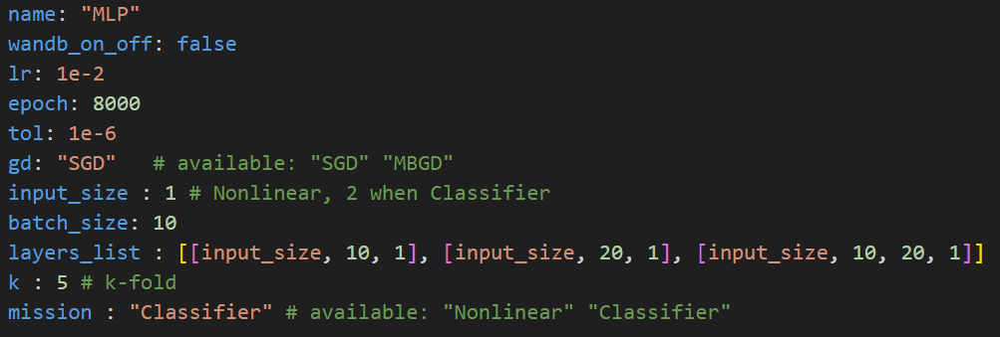 

## Results

### Task1: Nonlinear Function Approximation

   - Approximation comparison

  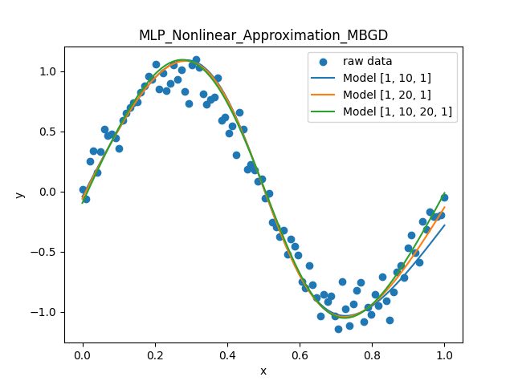
  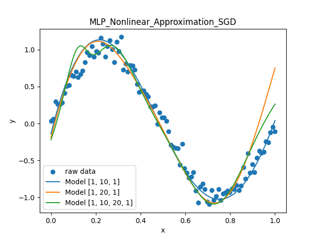

   - Loss comparison

  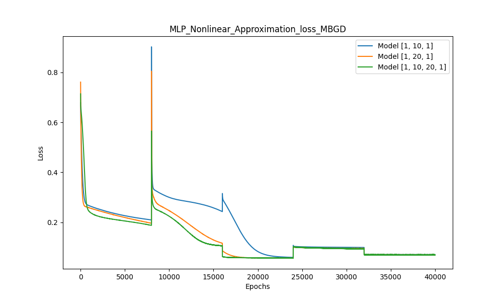
  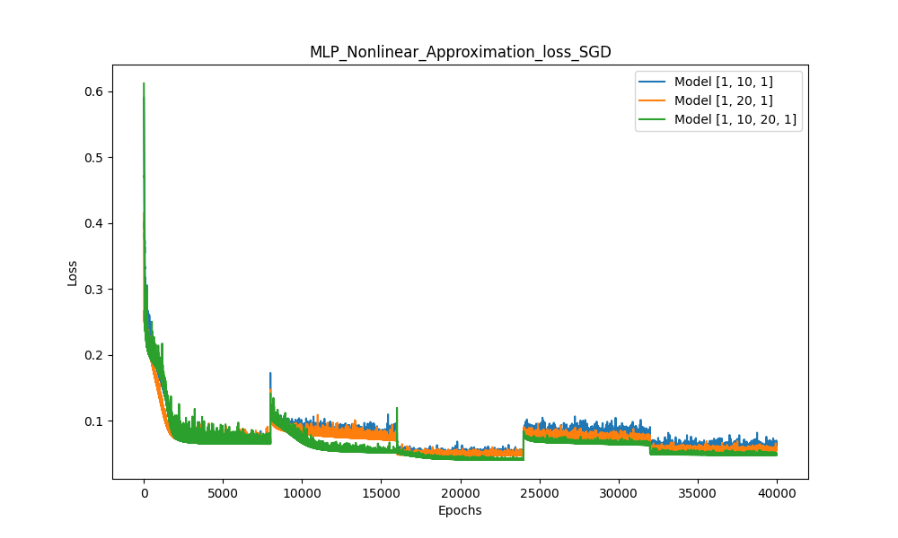

   - Model Performance comparison   

  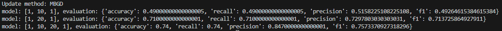
  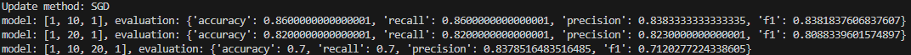

I generate a dataset with a function approximately like $y= sin(\beta x+ \theta)$. As figures shown above, model fits better when using mini-batch gradient descent to update. For the configuration of MLP model, Model [1, 10, 20, 1] has the best performance when using MBGD and Model [1, 10, 1] takes the lead when using SGD.

### Task2: Classifier Performance Evaluation
- Decision boundary comparison

  
  
  
  
  
  

   - Loss comparison

  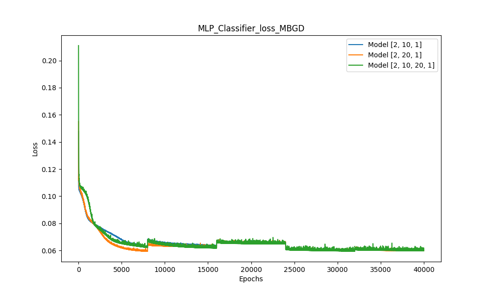
  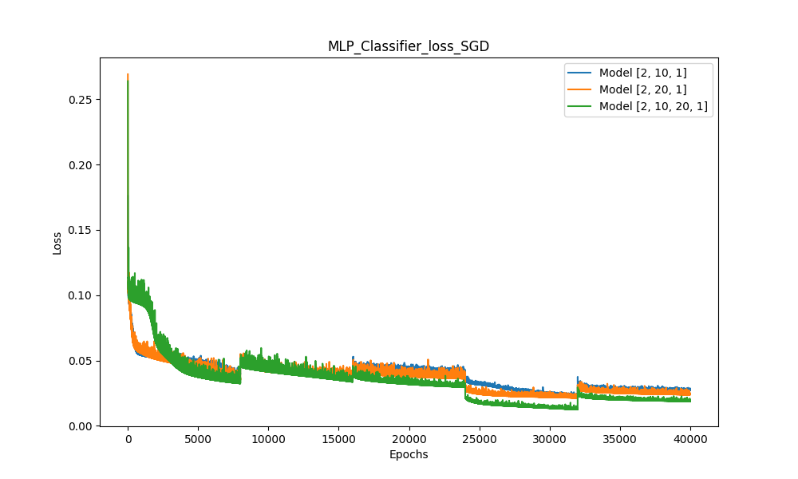

   - Model Performance comparison   

  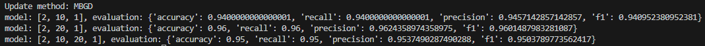
  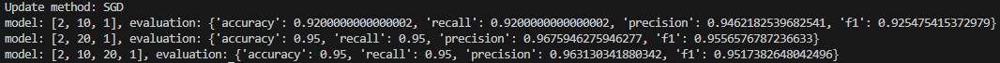

I generate a scatter dataset with same numbers and two different labels(colors). As figures shown above, model still fits better when using mini-batch gradient descent to update. For the configuration of MLP model, interestingly, Model [2, 20, 1] has the best performance both using MBGD and SGD.

## Conclusion
1. Mini-Batch update is better when network is bigger, in contrast of better performance while smaller network using stochastic update.
2. As all the networks in this assignment are constructed with small numbers of layers and the number of inputs is also small, the network with more neurons per layer and less number of layers somehow occur with the best performance in both tasks.
