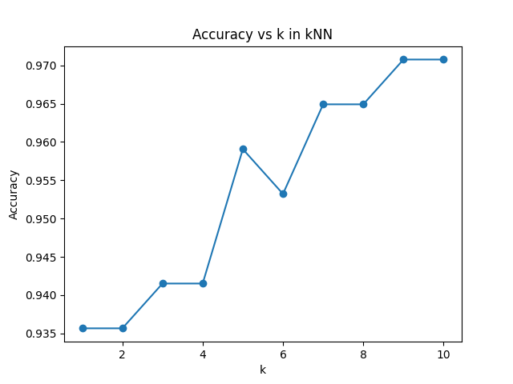

# AI and Machine Leanring HW-06
**12111820 黄国靖**

## Introduction
- Objective: In this assignment, you are required to perform the following tasks using the Breast Cancer Wisconsin (Original) data set, which is available under the filename wdbc.data. More information regarding the data set can be found in wdbc.names.
  - Data Splitting: Divide the dataset into a training set and a testing set with a ratio of 70% for training and 30% for testing.
  - KNN Algorithm Implementation: Write a code for the K-Nearest Neighbors (KNN) algorithm.
  - Testing and Analysis: Test the algorithm with varying values of k from 1 to 10 using the testing set, and provide the accuracy for each k. Analyze how the accuracy changes with different values of k.
  
## Methodology
1. Implement kNN model
2. Split dataset as required
3. Evaluate accuracy for each k using the testing set

## Results

  

As the figure shown above, the accuracy is higher and higher as k increases in general.