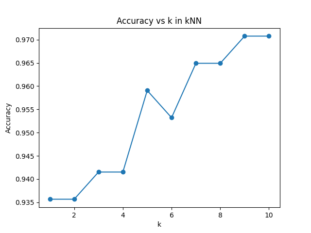

# AI and Machine Leanring HW-07
**12111820 黄国靖**

## Introduction
- Read and understand a decision tree and its visualization code;
- Use a portion of the data as the test dataset, and verify the classification performance of the decision tree using the test dataset. Evaluate using accuracy as the metric.
- During the code execution, you may encounter issues with the graphviz environment in the decision tree visualization part. Depending on your computer's operating system, you can search online for how to install graphviz and configure the correct path.
  
## Methodology
1. Implement kNN model
2. Split dataset with training data and testing data as 7:3
3. Train a decision tree model *dt01* using training data
4. Evaluate accuracy using the testing set

## Results

  

As the figure shown above, the accuracy is higher and higher as k increases in general.