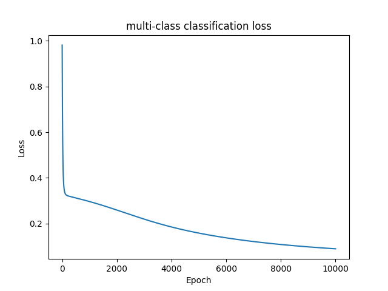
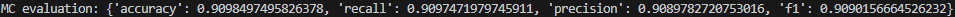

# AI and Machine Leanring HW-08
<div align="right">12111820 黄国靖</div>

## Introduction
In this assignment, you will leverage Python programming language and the Numpy library to construct a Multilayer Perceptron (MLP) model to address the multi-class classification problem of handwritten digit recognition. The dataset is sourced from the Optical Recognition of Handwritten Digits dataset available in the UCI Machine Learning Repository.
- **1.Dataset Description:**
    - Training dataset: optdigits.tra
    - Testing dataset: optdigits.tes
- **2.Data Format:**
    - Each row in the training and testing datasets represents a handwritten digit image
    - Columns 0 to 63 represent the input features, which are composed of 8x8 pixel images' grayscale values, reflecting the image's grayscale levels.
    - Column 64 (the 65th column) is the output class (label), ranging from 0 to 9, corresponding to different handwritten digits.
- **3.Assignment Tasks:**
    - Construct a Multilayer Perceptron (MLP) model using Numpy.
    - Train your MLP model using the training dataset optdigits.tra.
    - Evaluate your MLP model's performance using the testing dataset optdigits.tes.
    - Calculate and report the classification accuracy of your model on the test dataset.

## Procedure
1. Implement MLP model with forward and backward propagration, capable of handling hyperparameters
2. Load training data and validation data
3. Train a MLP model using training data
4. Using testing data to export evaluation of model performance
5. Plot trainning loss

## Model structure
```bash
└─ mc.py # whole file name
    ├─ load_data # load training and testing data, do one-hot encoding for the labels
    ├─ plot_loss # plot training loss
    ├─ class MLP # MLP model
      ├─ __init__ # initialize weights and necessary hyperparameters
      ├─ init_weights # the method of weights initialization
      ├─ forward_propagation # forward propagation with sigmoid function to activate
      ├─ backward_propagation # backward propagation with the derivative of sigmoid 
      ├─ fit # train the model, using cross entropy to calculate the loss
      ├─ predict # predict the labels using testing sets
      └─ evaluate # evaluate accuracy, recall, precision and f1 based on testing sets
    └─ main # complete the whole process
```
## Results
<style>
  .center-image {
    display: block;
    margin-left: auto;
    margin-right: auto;
  }
</style>

<div style="center-image">
  
  
</div>


