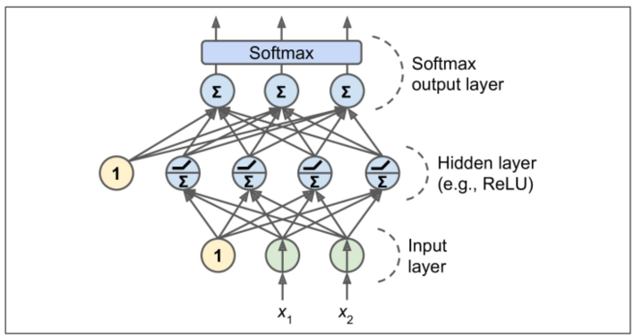

# Multi-class Classification

noted by Acheng0211(Guojing Huang, SUSTech)

- [Multi-class Classification](#multi-class-classification)
    - [**1.** *k*-Class Discriminant](#1-k-class-discriminant)
    - [**2.** Linear Regression for MC Classification](#2-linear-regression-for-mc-classification)
    - [**3.** Logistic Regression for MC Classification](#3-logistic-regression-for-mc-classification)
    - [**4.** MLP for MC Classification](#4-mlp-for-mc-classification)
    - [**5.** Multi-class *k*-NN and Decision Trees](#5-multi-class-k-nn-and-decision-trees)
___

### **1.** <big>*k*-Class Discriminant</big>
- $y_k(x) = w^T_kx + b_k, k = 1,...,K \qquad y_k(x)>y_j(x),\forall j \neq k$  ($w_k$ is now a vector, not the *k*-th coordinate)  
- decision boundary: $y_j(x)=y_k(x), \qquad (w_k-w_hj)^Tx+(b_k-b_j)=0$, the decision regions are always **singly connected** and **convex** ($\hat x = \lambda x_A + (1-\lambda)x_B$)

[back to the top](#multi-class-classification)

### **2.** <big>Linear Regression for MC Classification</big>
- $y(x) = \hat W^T \bar x$, where the *k*-th column of $\hat W$ is $[b_k,w^T_k]$, and $\bar x = [1,x]^T$
- Sum-of-least-squares loss: $$ l(\bar W) = \sum^N_{n=1}||\bar W^T \bar x^{(n)}-t{(n)}||^2 = ||X\bar W - T||^2_F
, \qquad \tilde W = (X^TX)^{-1}X^TT $$

[back to the top](#multi-class-classification)

### **3.** <big>Logistic Regression for MC Classification</big>
- $p(C_k|x) = y_k(x) = \frac{exp(z_k)}{\displaystyle \sum^{}_{j}exp(z_j)}$ = **softmax function**, $z_k = w^T_k x+b_k$ 
- likelyhood: $ L(T | x^{(1)}, \ldots, x^{(N)}, \bar{W}) = \prod_{n=1}^{N} \prod_{k=1}^{K} \left[ p(C_k | x^{(n)}) \right]^{t_k^{(n)}} = \prod_{n=1}^{N} \prod_{k=1}^{K} \left[ y_k(x^{(n)}) \right]^{t_k^{(n)}} $
- cross-entropy error: $E(\bar W) = -log:(T|\bar W) = - \displaystyle \sum^N_{n=1} \sum^K_{k=1} t^{(n)}_k log[y_k(x^{(n)})]$

[back to the top](#multi-class-classification)

### **4.** <big>MLP for MC Classification</big>

- The only difference is at the output layer with softmax
- The K outputs correspond to the probability of belonging to these classes
- The K outputs are **fully connected** with the linear output at the output layer via softmax

[back to the top](#multi-class-classification)

### **5.** <big>Multi-class *k*-NN and Decision Trees</big>
- can directly handle multi-class problems
  
[back to the top](#multi-class-classification)

