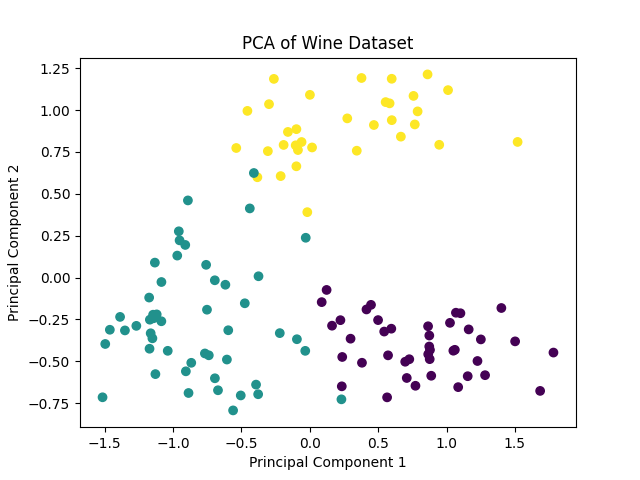
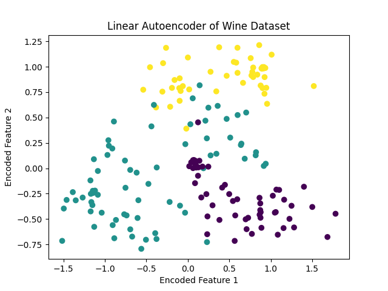
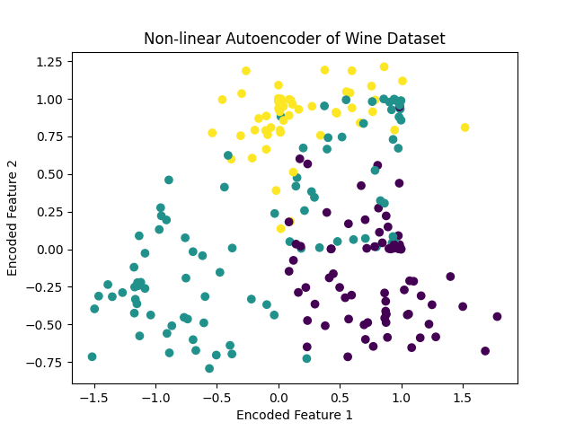
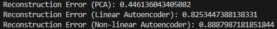

# AI and Machine Leanring HW-09

12111820 黄国靖

## Introduction
In this assignment, you will explore dimensionality reduction using Principal Component Analysis (PCA) and simple Autoencoders (both linear and non-linear) on the Wine dataset. You will implement these algorithms in Python using NumPy and compare their reconstruction errors.
1. Implement PCA:
   - Write a Python function using NumPy to perform PCA on the Wine dataset.
   - Consider only the first two principal components for dimensionality reduction.
   - Reconstruct the data using these two principal components.
   - Visualize the principal compoenents in the two dimensional space.

2. Train a Linear Autoencoder:
   - Implement a linear autoencoder using a neural network design.
   - Train the autoencoder on the Wine dataset.
   - Reconstruct the data using the trained autoencoder.
   - Visual lize the output of the encoder; Calculate and report the reconstruction error.

3. Train a Non-linear Autoencoder:
   - Implement a non-linear autoencoder with at least one hidden layer that uses an activation function (e.g., ReLU).
   - Train the non-linear autoencoder on the Wine dataset.
   - Reconstruct the data using the trained autoencoder.
   - Visual lize the output of the encoder; Calculate and report the reconstruction error.

4. Comparison and Analysis:
   - Compare the reconstruction errors of the PCA, linear autoencoder, and non-linear autoencoder.
   - Analyze the results and discuss which method provides the best reconstruction accuracy and why.

## Procedure
1. Implement PCA, Linear Autoencoder and Non-linear Autoencoder
2. Load training data and validation data
3. Train three models one by one
4. Visuallize the outputs and compute recontruction errors respectively

## Results

  
  
  
  

## Analysis
- After data loading and preprocess, the raw *wine_data* is devided into training sets and testing sets, which is used for model training and reconstruction error evaluation respectively. 
- As the outputs shown above, PCA is implemented by NumPy and consider only the first two principal components for dimensionality reduction, which performs the best and earns the smallest reconstruction error. 
- The Linear Autoencoder and Non-linear Autoencoder are trained with learning rate of **0.01** and **0.001** correspondingly while training iterations is **80000** for both models. It is obvious that Linear autoencoder performs better than the Non-linear one.

