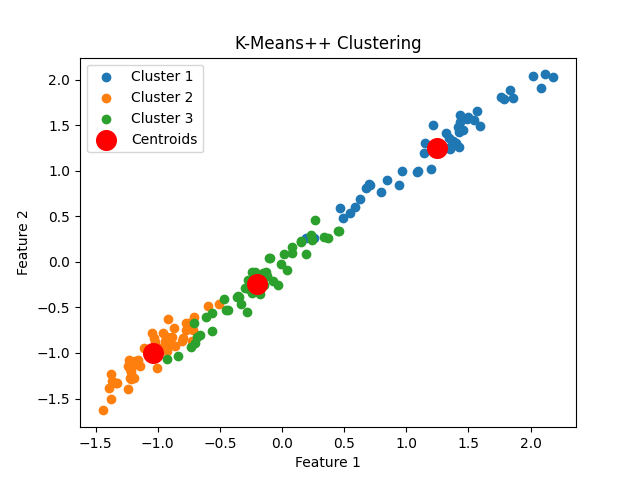
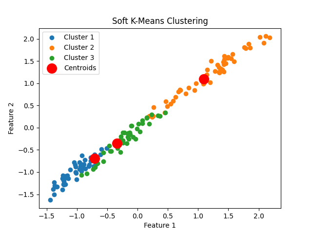
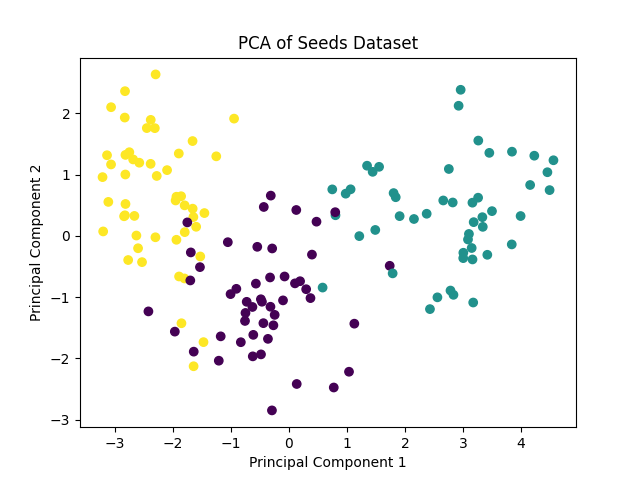
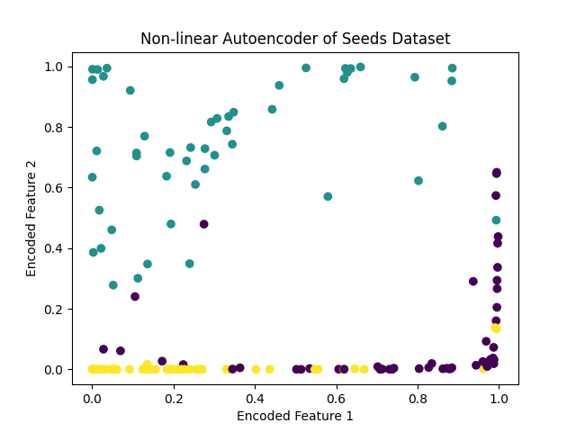
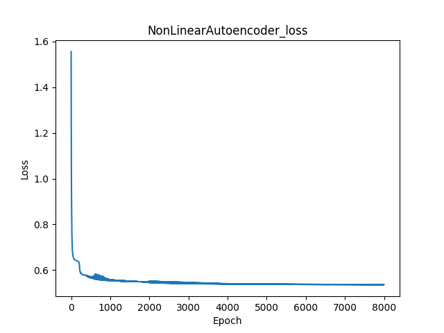
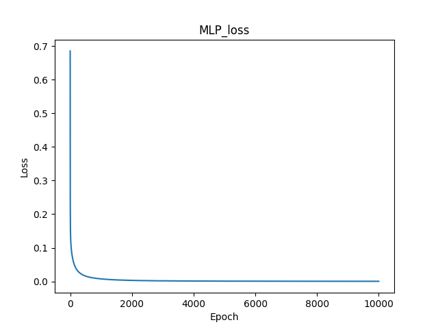
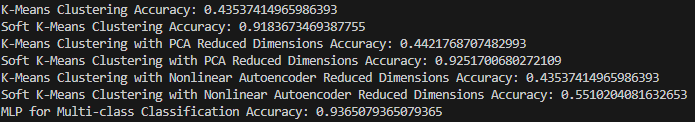
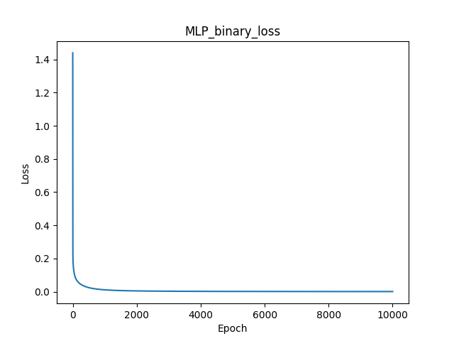
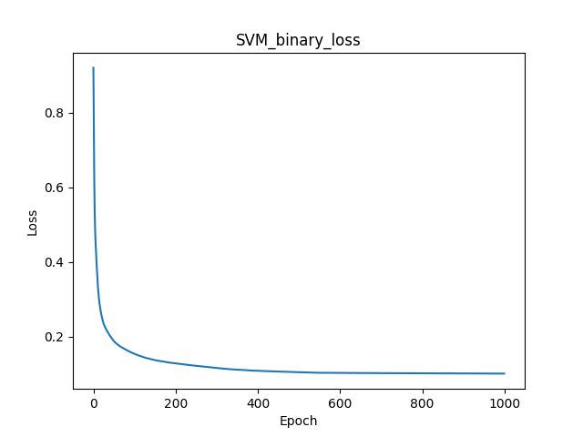
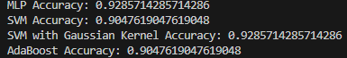

# AI and Machine Learning Final Project

12111820 黄国靖

## Results

#### Clustering Results

1. **K-Means++ Clustering Results**
   

       
    

     

     

        

       
       
     

2. **Soft K-Means Clustering Results**
   

       
     

    

      
       
     

#### Classification Results

1. **MLP Classification Results**
   - Multi-class Classification:
     

      
      
      
       
       
     

   - Binary Classification:
     

       
       
       
     

### Comparison and Discussion

#### Clustering Results Comparison

1. **K-Means++ and Soft K-Means**
   - **PCA Reduced Data**:
     - K-Means++ and Soft K-Means perform similarly on PCA reduced data, but Soft K-Means may perform better on boundary samples due to its soft assignment nature.
   - **Non-linear Autoencoder Reduced Data**:
     - Non-linear autoencoder captures non-linear features of the data, resulting in more distinct clustering results for both K-Means++ and Soft K-Means.

#### Classification Results Comparison

1. **MLP**
   - **Multi-class Classification**:
     - MLP performs well on multi-class classification, effectively classifying different types of seeds.
   - **Binary Classification**:
     - MLP also performs well on binary classification, with the loss curve showing model convergence.

2. **SVM and SVM with Gaussian Kernel**
   - **SVM**:
     - SVM performs well on binary classification, effectively finding the decision boundary.
   - **SVM with Gaussian Kernel**:
     - SVM with Gaussian Kernel handles non-linear data better, outperforming linear SVM according to accuracy.

3. **AdaBoost**
   - AdaBoost improves classification performance by combining multiple weak classifiers, which performs the same as SVM.

### Advantages and Disadvantages Discussion

1. **K-Means++ and Soft K-Means**
   - **Advantages**:
     - Simple to implement and computationally efficient.
     - K-Means++ effectively initializes cluster centers, avoiding local optima.
     - Soft K-Means handles samples on the boundary better.
   - **Disadvantages**:
     - Sensitive to initial values, may get stuck in local optima.
     - Requires pre-specifying the number of clusters.

2. **MLP**
   - **Advantages**:
     - Handles complex non-linear relationships.
     - Suitable for both multi-class and binary classification problems.
   - **Disadvantages**:
     - Long training time and high computational resource consumption.
     - Requires tuning to avoid overfitting.

3. **SVM and SVM with Gaussian Kernel**
   - **Advantages**:
     - Finds optimal decision boundaries, suitable for high-dimensional data.
     - SVM with Gaussian Kernel handles non-linear data.
   - **Disadvantages**:
     - Long training time for large datasets.
     - Requires tuning to select appropriate kernel and parameters.

4. **AdaBoost**
   - **Advantages**:
     - Improves classification performance by combining multiple weak classifiers.
     - Good generalization ability.
   - **Disadvantages**:
     - Sensitive to noisy data, may lead to overfitting.
     - Long training time and high computational resource consumption.

### Summary and Conclusions

Based on the application and comparison of different machine learning methods on the wheat seed dataset, we can draw the following conclusions:

1. **Clustering Methods**:
   - K-Means++ and Soft K-Means perform well on reduced data, especially on non-linear autoencoder reduced data.
   - Soft K-Means performs better on boundary samples.

2. **Classification Methods**:
   - MLP performs well on both multi-class and binary classification problems, effectively classifying different types of seeds.
   - SVM and SVM with Gaussian Kernel perform well on binary classification, with SVM with Gaussian Kernel handling non-linear data better.
   - AdaBoost improves classification performance by combining multiple weak classifiers, but is sensitive to noisy data.

Overall, different machine learning methods have their own strengths and weaknesses on the wheat seed dataset. The choice of method depends on the specific characteristics and requirements of the problem.