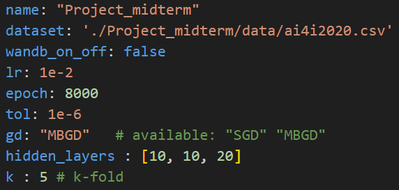
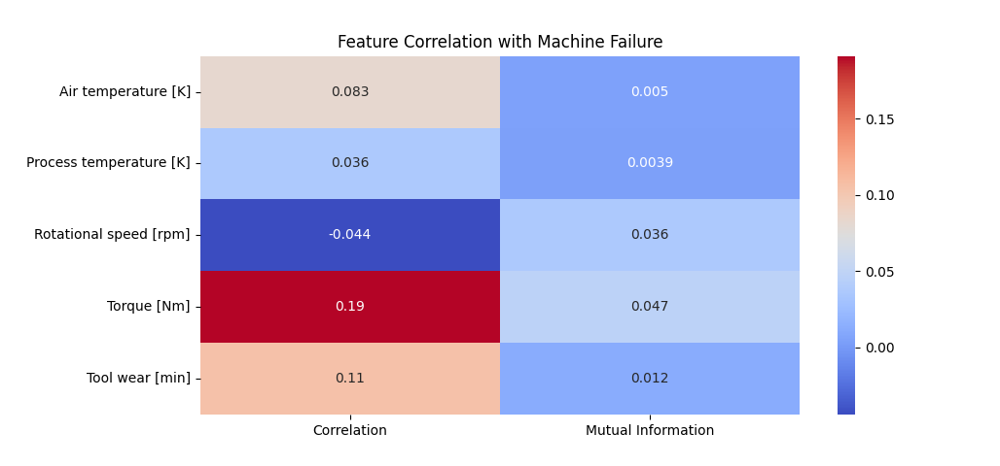
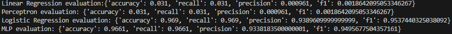
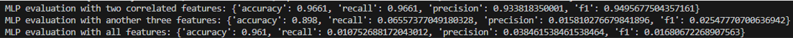

# AI and Machine Leanring Midterm Project Report
<div align="right">12111820 黄国靖</div>

## Tasks:
1. **Data Preprocessing:**
   - Load the dataset and perform basic data cleaning to handle missing values and irrelevant features.
   - Normalize or standardize the features if necessary.

2. **Feature Engineering:**
   - Select or engineer features that could be relevant for predicting machine failures.

3. **Model Implementation:**
   - Implement linear regression, perceptron, and logistic regression models to predict machine failures.
   - Implement an MLP model to predict machine failures, using at least one hidden layer.

4. **Model Training and Evaluation:**
   - Split the dataset into training and testing sets (e.g., 70% training, 30% testing).
   - Train each model on the training set and evaluate their performance on the testing set.
   - Use appropriate metrics such as accuracy, precision, recall, F1-score, to evaluate the models.

5. **Model Comparison:**
   - Compare the performance of the different models.
   - Discuss the strengths and weaknesses of each model in the context of predictive maintenance.

6. **Hyperparameter Tuning:**
   - Perform hyperparameter tuning for the perceptron, logistic regression, and MLP models to improve their performance.

## Methodology
1. Load the dataset, using mean method to handle missing values and extract relevant features(*utils.py in line 50-89*)
2. Split the dataset into 70% training and 30% testing sets
3. Implement linear regression, perceptron, logistic regression and MLP models(*model.py*)
4. Compare the evaluation of 4 models using all the features(*train.py*)
5. Compare the evaluation of logistic regression model under the conditions of diffenrent input features(*train.py*)

## Settings
Most of general hyperparameters are generated in *./conf/config_proj_midterm.yaml*, including learning rate, overall iterations, loss tolerance, gradient decent method and hidden layers of MLP model.
 

## Results                 
#### Task1: Compare the evaluation of 4 models using two correlated features
At first, I generated the correlation matrix between all the features and machine failure as shown.
 
Then I select Torque and Tool Wear to train because it seemed that these two features are highly relevant for predicting machine failures relatively.
After implementation of four models, the evaluation metrixes of each models are as follows.
 
```python
Linear Regression evaluation: {'accuracy': 0.1216667, 'recall': 0.1216667, 'precision': 0.9462655307109987, 'f1': 0.17123934269734817}
Perceptron evaluation: {'accuracy': 0.031, 'recall': 0.031, 'precision': 0.000961, 'f1': 0.0018642095053346267}
Logistic Regression evaluation: {'accuracy': 0.969, 'recall': 0.969, 'precision': 0.938960999, 'f1': 0.9537440325038092} 
MLP evaluation: {'accuracy': 0.9661, 'recall': 0.9661, 'precision': 0.933818350001, 'f1': 0.9495677504357161}
```

#### Task2: Compare the evaluation of logistic regression model under the conditions of diffenrent input features
In this task, I was curious about the results of using those unrelative features. Then I use MLP model to train under three inputs conditions: default(two correlated features), without two temperature features and with only two temperature features.
 
```python
MLP evaluation with two correlated features: {'accuracy': 0.9661, 'recall': 0.9661, 'precision': 0.933818350001, 'f1': 0.9495677504357161}
MLP evaluation with another three features: {'accuracy': 0.898, 'recall': 0.06557377049180328, 'precision': 0.015810276679841896, 'f1': 0.02547770700636942}
MLP evaluation with all features: {'accuracy': 0.961, 'recall': 0.010752688172043012, 'precision': 0.038461538461538464, 'f1': 0.01680672268907563}
```

## Findings and Conclusions
1. Linear regression and Perceptron have bad performance due to nonlinear features and the binary classification problem to do. Meanwhile, logistic regression and MLP perform better.
2. Using correlated features to train is important, which is truly reflected from the evaluation results
